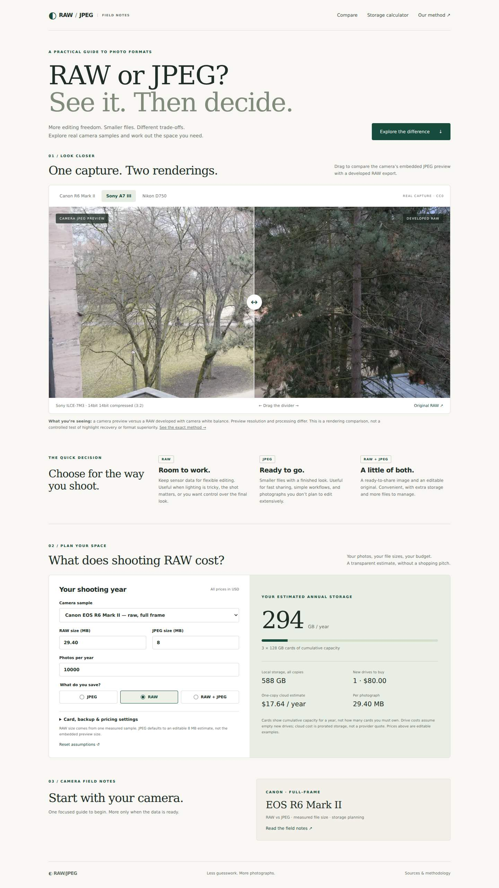

# RAW vs JPEG — MVP

English photography tool: three CC0 sample comparisons, an editable storage calculator, one Canon R6 Mark II field-notes page and an open methodology page. Astro static output; native CSS/JS slider. No uploads, accounts, ads or affiliates.

## Run

Node 24 or later recommended.

```sh
npm ci
npm run dev
npm test
npm run build
```

Deploy to Cloudflare Pages: build `npm run build`, output `dist`. The MVP has no hard-coded domain; add the production domain and canonical/sitemap configuration once assigned.

## Integrity and limitations

The comparison is embedded camera JPEG preview vs LibRaw-developed RAW, **not** a separate full-resolution camera JPEG and **not** a controlled exposure/WB/noise experiment. RAW is explicitly labeled developed. Three CC0 originals were downloaded and SHA-256 verified. `src/data/samples.json` records original byte sizes, processing modes, source URLs and checksums. Originals are not committed.

Calculator RAW defaults are single measured files, not camera averages. JPEG defaults to an editable 8 MB assumption. Decimal storage units, rounded whole-card/whole-drive counts and user-entered prices are disclosed. There is no verified burst-buffer calculation.

## Reproduce images

```sh
pip install -r scripts/requirements.txt
python scripts/prepare_samples.py
```

See `public/recipe.txt`. First image is eager-loaded; alternate-camera images load on selection. WebP images have JPEG fallbacks. No synthetic RAW or AI photo is used.

## Next milestone

Acquire controlled same-capture RAW + full-resolution camera JPEG pairs for recovery experiments. Add camera pages only with unique samples and useful data. Configure production origin, sitemap and robots once deployment is selected. Run actual mobile-network performance checks before claiming Core Web Vitals targets.

## Preview



Browser checks covered camera switching, keyboard slider, calculator/reset, image loading, three routes and overflow at 320/390px.
